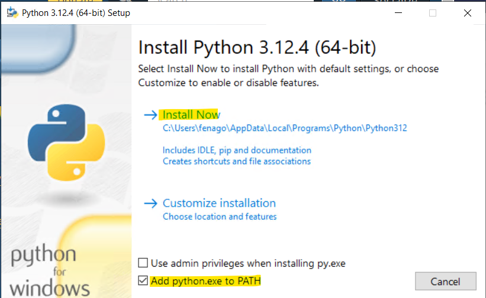
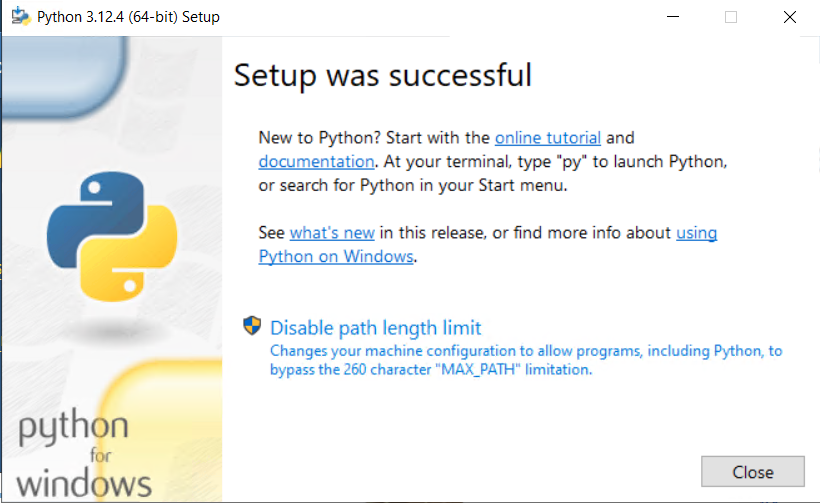
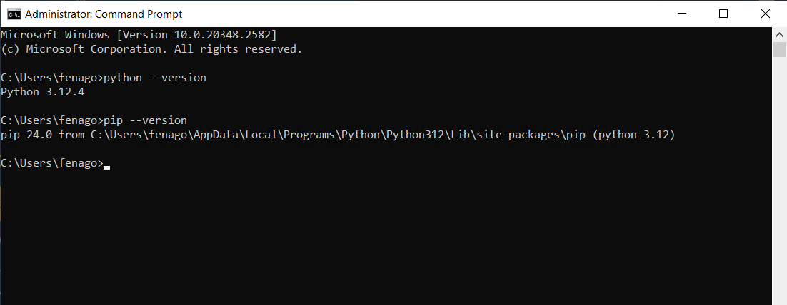
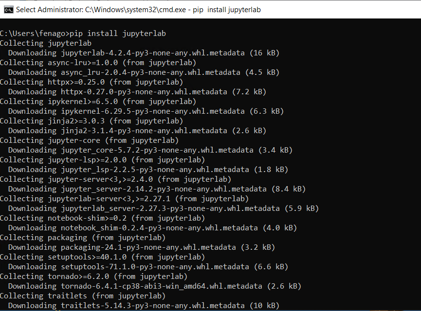
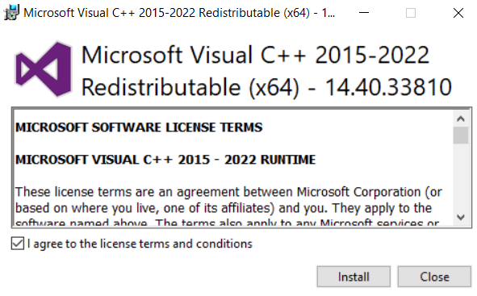
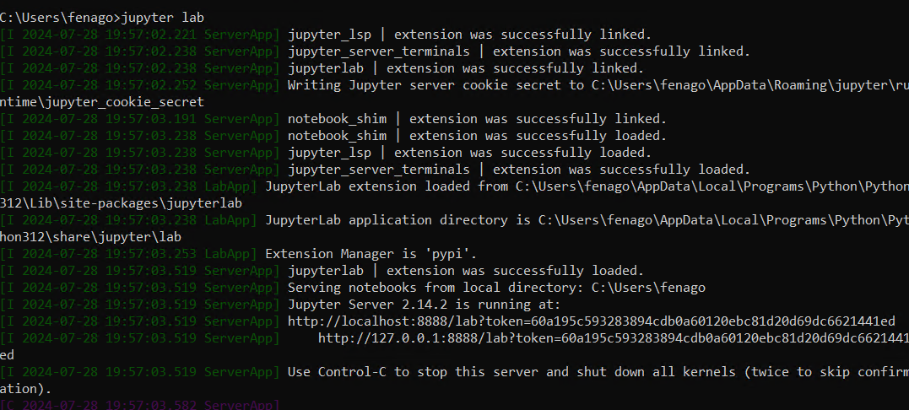
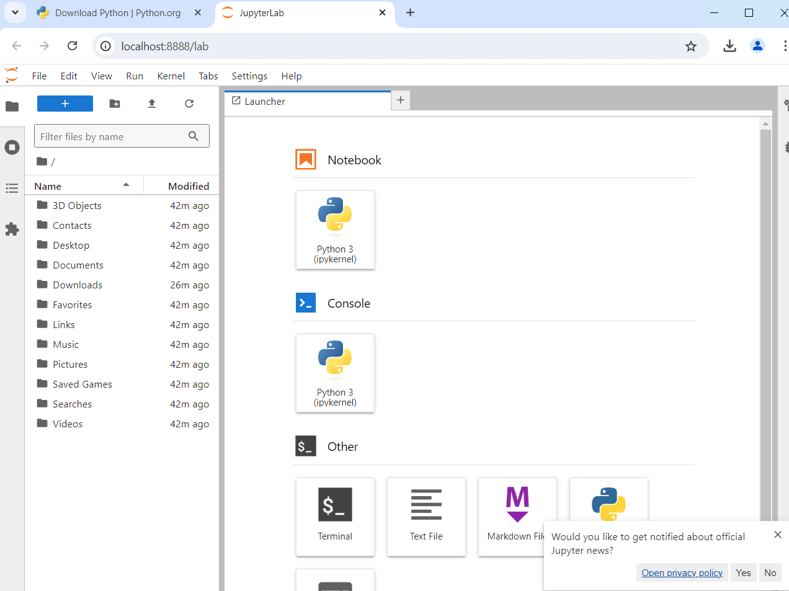
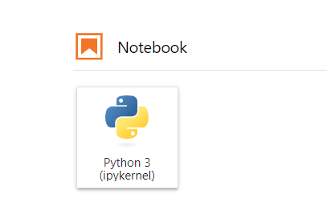
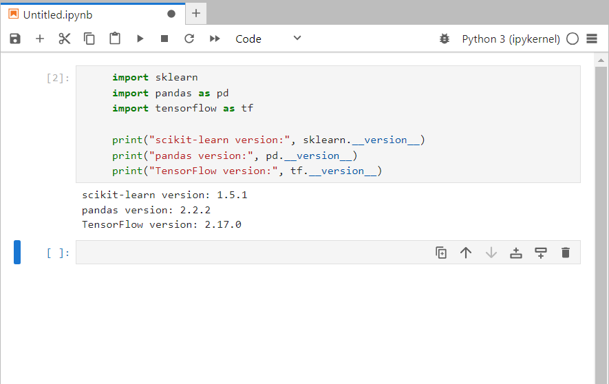

## Machine Learning Essentials (TTML5506-P) - Setup Guide (Windows)


### Pre-Reqs:

- Windows OS
- Google Chrome (set as default browser)

### Step 1: Install Python
1. **Download Python:**
   - Go to the official [Python website](https://www.python.org/downloads/).
   - Download the latest version of Python.

2. **Install Python:**
   - Run the downloaded installer.
   - Check the box that says "Add Python to PATH".
   - Click on "Install Now".

	

   - Click on "Disable path length limit".

	


### Step 2: Install pip (Python package installer)
Pip should be installed automatically with Python. You can verify by running the following command in Command Prompt:
```sh
python --version

pip --version
```




### Step 3: Install Jupyter Notebook
1. **Open Command Prompt:**
   - Press `Win + R`, type `cmd`, and press `Enter`.

2. **Install Jupyter:**
   - Run the following command:
     ```sh
     pip install jupyterlab
     ```
	 
	

### Step 4: Install scikit-learn, pandas, and TensorFlow
1. **Install scikit-learn:**
   - Run the following command in Command Prompt:
     ```sh
     pip install scikit-learn
     ```

2. **Install pandas & numpy:**
   - Run the following command in Command Prompt:
     ```sh
     pip install pandas numpy
     ```

3. **Install TensorFlow:**
   - Run the following command in Command Prompt:
     ```sh
     pip install tensorflow
     ```

### Step 5: Install Microsoft Visual C++ Redistributable

You can get download link from here:

`https://learn.microsoft.com/en-us/cpp/windows/latest-supported-vc-redist?view=msvc-170`

If you have "X64" Architecture, you can download this directly:

`https://aka.ms/vs/17/release/vc_redist.x64.exe`


	

### Step 6: Verify Installation
1. **Launch Jupyter Lab:**
   - In Command Prompt, run:
     ```sh
     jupyter lab
     ```
	 
	

   - This will open Jupyter Lab in your default web browser.
	
	

2. **Create a new Notebook:**
   - Click on "Python 3".

	
	
3. **Test the Libraries:**
   - In the new notebook, enter the following code to verify the installations:
     ```python
     import sklearn
     import pandas as pd
     import tensorflow as tf

     print("scikit-learn version:", sklearn.__version__)
     print("pandas version:", pd.__version__)
     print("TensorFlow version:", tf.__version__)
     ```
   - Run the cell. You should see the versions of scikit-learn, pandas, and TensorFlow printed out.

	
	
### Additional Steps (Optional)
1. **Upgrade pip:**
   - You can upgrade pip to the latest version by running:
     ```sh
     pip install --upgrade pip
     ```

### Troubleshooting
- If you encounter any issues with the installations, make sure your Command Prompt is run as an administrator.
- Ensure that Python and pip are added to your system PATH:
- Add Python and pip to PATH:
	* In the Edit Environment Variable window, click on New and add the path to your Python installation directory. This is usually `C:\Python3(Version)` or `C:\Users\<YourUsername>\AppData\Local\Programs\Python\Python3(Version)` depending on your installation.
	* Add another new entry for the Scripts directory inside your Python installation directory. This is usually C:\Python3(Version)\Scripts or `C:\Users\<YourUsername>\AppData\Local\Programs\Python\Python3(Version)\Scripts`.
